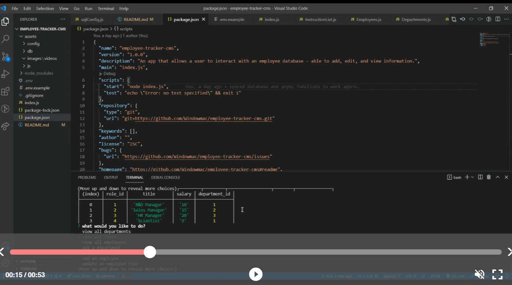

# Employee-Tracker-CMS
  

  ## Description:
  ___
  a console-based app that allows the user to update, add to, and display information from their employee database.

  ## Table of Contents:
  ___
  1) [Description](#description)
  2) [Installation](#installation)
  3) [Usage](#usage)
  4) [Video](#video)
  5) [Collaboration](#collaboration)
  6) [Tests](#tests)
  7) [Questions?](#questions?)
  8) [GitHub](#gitHub)
  9) [License](#license)

  ## Installation
  ___
  fork repository, create .env file, and run npm start.

  ## Usage
  ___
  Used primarily for sql database management. it removes the sql from the user and makes interacting with the employee database more user-friendly by providing more human commands to interact with. Insert, update, add and view departments, roles, and employees. Assign managers, move employees, etc. Deletion yet to be added.

  ## Video
  ___
  

  ## Collaboration:
  ___
  For now, just follow the [Contributor Covenant](https://www.contributor-covenant.org/)

  ## Tests
  ___
  none yet

  ## Questions?
  ___
  Please contact me at:
  My [GitHub](https://github.com/Windowmac)
  
  Or Email:
  <mckendree.strommer@gmail.com>

  
  ## License: 
  ___
  Licensed under [Mozilla Public License 2.0](https://opensource.org/licenses/MPL-2.0)